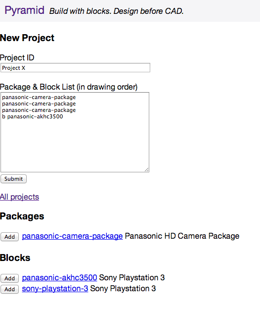

Pyramid
=======

Build with blocks. Design before CAD.

Pyramid gets design data development out of CAD where it belongs. This leaves CAD to do what it does best: visual layout development.

Pyramid is intended to be an intranet webserver that allows CAD designers to create blocks and packages of blocks before touching CAD. These blocks contain block attributes with a Pyramid unique ID.  This allows for creating blocks outside of CAD and more importantly regularly updating drawing block attributes by script.

***
## For example, project create

***
## Project edit

***
## Project CSV Output

    b7d04a35fcab3a831e2b,panasonic-akhc3500,Panasonic AK-HC3500,-400,0,0,in1-connector,bnc,in1-label,HD-SDI In,in1-signal,hdsdi,out1-connector,hdmi1,out1-label,HDMI Out,out1-signal,hdmi,bi1-connector,db9,bi1-label,Serial 1,bi1-signal,rs232

    e1b0abb539e428d9dabf,panasonic-akhc3500,Panasonic AK-HC3500,-200,0,0,in1-connector,bnc,in1-label,HD-SDI In,in1-signal,hdsdi,out1-connector,hdmi1,out1-label,HDMI Out,out1-signal,hdmi,bi1-connector,db9,bi1-label,Serial 1,bi1-signal,rs232

    526716e12852ff73f0e2,panasonic-akhc3500,Panasonic AK-HC3500,0,0,0,in1-connector,bnc,in1-label,HD-SDI In,in1-signal,hdsdi,out1-connector,hdmi1,out1-label,HDMI Out,out1-signal,hdmi,bi1-connector,db9,bi1-label,Serial 1,bi1-signal,rs232

    b19d4ace1b043f6e2272,panasonic-akhc3500,Panasonic AK-HC3500,-400,140,0,in1-connector,bnc,in1-label,HD-SDI In,in1-signal,hdsdi,out1-connector,hdmi1,out1-label,HDMI Out,out1-signal,hdmi,bi1-connector,db9,bi1-label,Serial 1,bi1-signal,rs232

    35a0464438e2ab738aaf,panasonic-akhc3500,Panasonic AK-HC3500,-200,140,0,in1-connector,bnc,in1-label,HD-SDI In,in1-signal,hdsdi,out1-connector,hdmi1,out1-label,HDMI Out,out1-signal,hdmi,bi1-connector,db9,bi1-label,Serial 1,bi1-signal,rs232

    3df7638a2abb769351dd,panasonic-akhc3500,Panasonic AK-HC3500,0,140,0,in1-connector,bnc,in1-label,HD-SDI In,in1-signal,hdsdi,out1-connector,hdmi1,out1-label,HDMI Out,out1-signal,hdmi,bi1-connector,db9,bi1-label,Serial 1,bi1-signal,rs232

    c66e51b27d560387fe5b,panasonic-akhc3500,Panasonic AK-HC3500,-400,280,0,in1-connector,bnc,in1-label,HD-SDI In,in1-signal,hdsdi,out1-connector,hdmi1,out1-label,HDMI Out,out1-signal,hdmi,bi1-connector,db9,bi1-label,Serial 1,bi1-signal,rs232

    dcfdef0bc28211338a99,panasonic-akhc3500,Panasonic AK-HC3500,-200,280,0,in1-connector,bnc,in1-label,HD-SDI In,in1-signal,hdsdi,out1-connector,hdmi1,out1-label,HDMI Out,out1-signal,hdmi,bi1-connector,db9,bi1-label,Serial 1,bi1-signal,rs232

    db35ed323cdc81c4c939,panasonic-akhc3500,Panasonic AK-HC3500,0,280,0,in1-connector,bnc,in1-label,HD-SDI In,in1-signal,hdsdi,out1-connector,hdmi1,out1-label,HDMI Out,out1-signal,hdmi,bi1-connector,db9,bi1-label,Serial 1,bi1-signal,rs232

    326950d417f9e09d1b1d,panasonic-akhc3500,Panasonic AK-HC3500,0,420,0,in1-connector,bnc,in1-label,HD-SDI In,in1-signal,hdsdi,out1-connector,hdmi1,out1-label,HDMI Out,out1-signal,hdmi,bi1-connector,db9,bi1-label,Serial 1,bi1-signal,rs232
