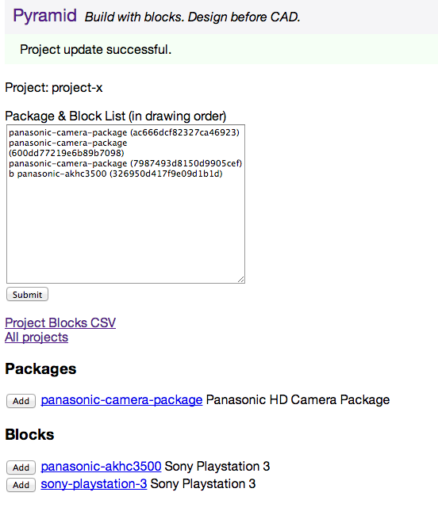

Pyramid
=======

Build with blocks. Design before CAD.

Pyramid gets design data development out of CAD where it belongs. This leaves CAD to do what it does best: visual layout development.

Pyramid is intended to be an intranet webserver that allows CAD designers to create blocks and packages of blocks before touching CAD. These blocks contain block attributes with a Pyramid unique ID.  This allows for creating blocks outside of CAD and more importantly regularly updating drawing block attributes by script.

***
## For example, project create

***
## Project edit

***
## Project CSV Output

    054faf32a05b9999f295,sony-playstation-3,Sony Playstation 3,-400,0,0,in1-connector,bnc,in1-label,HD-SDI In,in1-signal,hdsdi,out1-connector,hdmi1,out1-label,HDMI Out,out1-signal,hdmi,bi1-connector,db9,bi1-label,Serial 1,bi1-signal,rs232

    402eb19c5138f2e7f8fe,sony-playstation-3,Sony Playstation 3,-200,0,0,in1-connector,bnc,in1-label,HD-SDI In,in1-signal,hdsdi,out1-connector,hdmi1,out1-label,HDMI Out,out1-signal,hdmi,bi1-connector,db9,bi1-label,Serial 1,bi1-signal,rs232

    1661c0de6b40df4263a6,sony-playstation-3,Sony Playstation 3,0,0,0,in1-connector,bnc,in1-label,HD-SDI In,in1-signal,hdsdi,out1-connector,hdmi1,out1-label,HDMI Out,out1-signal,hdmi,bi1-connector,db9,bi1-label,Serial 1,bi1-signal,rs232

    574e0103a34e48872ce8,sony-playstation-3,Sony Playstation 3,-400,140,0,in1-connector,bnc,in1-label,HD-SDI In,in1-signal,hdsdi,out1-connector,hdmi1,out1-label,HDMI Out,out1-signal,hdmi,bi1-connector,db9,bi1-label,Serial 1,bi1-signal,rs232

    2a3222e843715db26b73,sony-playstation-3,Sony Playstation 3,-200,140,0,in1-connector,bnc,in1-label,HD-SDI In,in1-signal,hdsdi,out1-connector,hdmi1,out1-label,HDMI Out,out1-signal,hdmi,bi1-connector,db9,bi1-label,Serial 1,bi1-signal,rs232

    57b2a3f57e9ede7395eb,sony-playstation-3,Sony Playstation 3,0,140,0,in1-connector,bnc,in1-label,HD-SDI In,in1-signal,hdsdi,out1-connector,hdmi1,out1-label,HDMI Out,out1-signal,hdmi,bi1-connector,db9,bi1-label,Serial 1,bi1-signal,rs232

    d65ecf9913aadf402eaa,sony-playstation-3,Sony Playstation 3,0,280,0,in1-connector,bnc,in1-label,HD-SDI In,in1-signal,hdsdi,out1-connector,hdmi1,out1-label,HDMI Out,out1-signal,hdmi,bi1-connector,db9,bi1-label,Serial 1,bi1-signal,rs232
